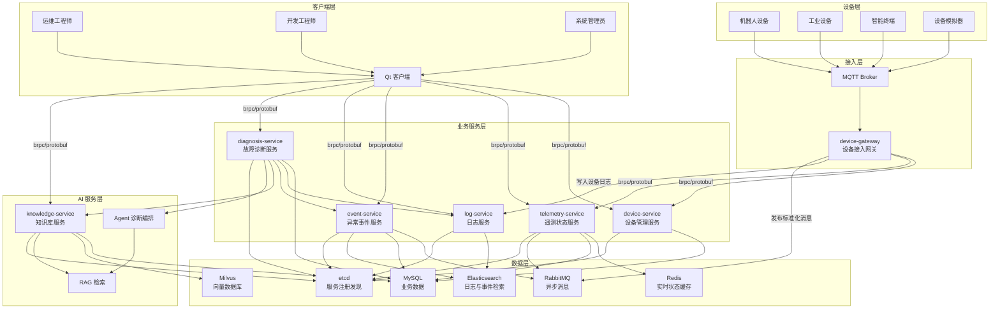
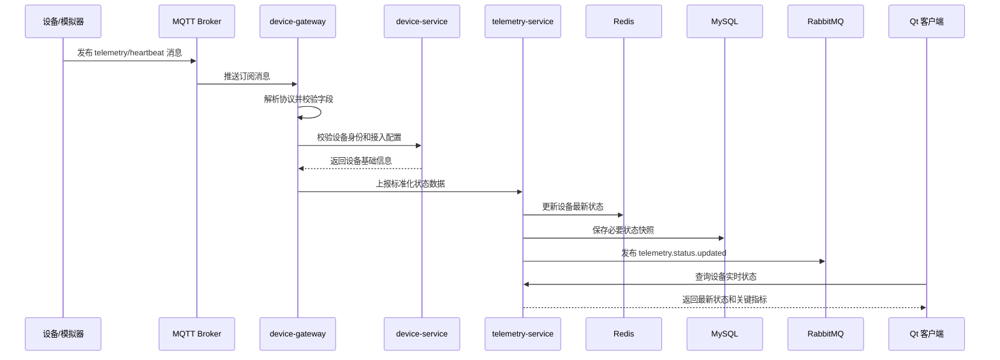
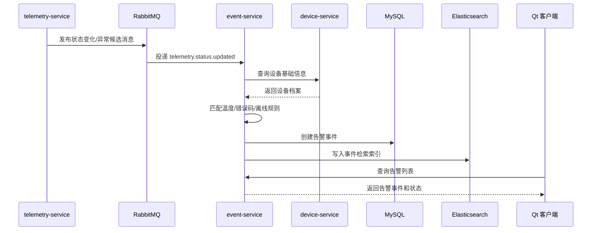
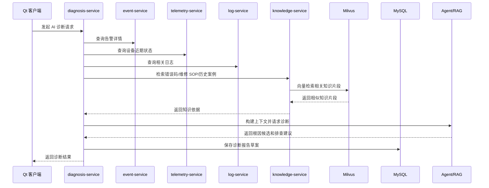

# DeviceOps 系统架构设计文档

| 文档项 | 内容 |
| --- | --- |
| 项目名称 | DeviceOps |
| 当前阶段 | Phase 2：系统架构设计 |
| 输入文档 | docs/01_requirement.md |
| 文档版本 | v0.1.0 |
| 目标读者 | 架构师、后端工程师、AI 工程师、测试工程师、运维工程师 |
| 文档状态 | 初稿 |

## 1. 整体架构

### 1.1 架构目标

DeviceOps 采用企业级微服务架构，围绕“设备接入、状态监控、异常告警、日志检索、知识库检索、AI 诊断报告”形成完整业务闭环。系统设计优先满足以下目标：

- 设备接入稳定：支持机器人、工业设备、智能终端等设备通过 MQTT 上报状态、事件和日志。
- 服务边界清晰：按照设备管理、遥测数据、事件告警、日志、知识库和诊断能力拆分服务。
- 数据按用途分层：业务数据、实时状态、日志检索、向量检索分别使用合适的数据组件。
- 诊断链路可追踪：一次故障可关联设备、状态、告警、日志、知识库依据和 AI 诊断报告。
- 后续可扩展：保留协议扩展、规则扩展、知识库扩展和 Agent 工具调用扩展能力。

### 1.2 分层设计

系统按职责分为六层：

- 设备层：机器人、工业设备、智能终端和设备模拟器，负责产生状态、事件和日志。
- 接入层：负责设备连接、MQTT 消息接入、协议解析、数据标准化和向内部服务转发。
- 业务服务层：负责设备管理、状态处理、异常事件、日志检索和诊断记录等核心业务。
- AI 服务层：负责知识库检索、向量检索、RAG 上下文构建和 Agent 诊断。
- 数据层：负责业务数据、实时状态、日志索引、向量数据和异步消息存储。
- 客户端层：面向运维工程师、开发工程师、系统管理员提供 Qt 客户端或后续管理端能力。

### 1.3 整体架构图



## 2. 微服务拆分

### 2.1 服务拆分原则

- 高内聚：每个服务围绕一个明确业务能力建设，避免一个服务承担过多职责。
- 低耦合：服务之间通过 brpc + protobuf 进行同步通信，通过 RabbitMQ 进行异步解耦。
- 数据归属明确：核心业务数据由对应服务负责写入和维护，其他服务通过接口获取。
- 可独立演进：服务可按业务优先级逐步实现，MVP 阶段先完成最小闭环。

### 2.2 device-gateway

| 项目 | 说明 |
| --- | --- |
| 职责 | 负责设备接入、MQTT 消息订阅、设备认证、协议解析、基础校验、数据标准化和路由转发。 |
| 输入 | 设备 MQTT 消息、设备心跳、设备状态数据、错误码、设备运行日志。 |
| 输出 | 标准化设备注册请求、设备状态消息、设备告警消息、设备日志消息、设备在线离线事件、协议解析错误日志。 |
| 依赖 | MQTT Broker、device-service、telemetry-service、event-service、log-service、RabbitMQ、etcd。 |
| 技术 | C++17、MQTT、brpc、protobuf、RabbitMQ Client、cpp-microservice-kit 基础能力。 |

设计说明：

- device-gateway 是设备侧流量进入平台的第一站，核心职责是接入、协议转换和转发，不承担复杂业务判断。
- 设备消息进入后先做协议解析、字段校验和设备身份识别。
- 标准化后的注册、状态、告警、日志、心跳消息按路由规则转发给对应内部服务。
- 网关只做轻量校验和转发决策，不保存设备主数据、不持久化实时状态、不执行告警规则、不执行故障诊断。
- 同步转发用于需要立即确认的内部调用，异步投递用于削峰、解耦和后续扩展消费者。
- MQTT 能力当前脚手架可能没有，需要在基础框架中补充封装，但不能重复实现已有 RPC、日志、注册发现等能力。

转发规则：

| MQTT Topic | 网关处理 | 转发目标 |
| --- | --- | --- |
| `device/{device_id}/register` | 认证、解析注册信息、补充接入上下文 | `device-service` |
| `device/{device_id}/telemetry` | 解析状态数据、标准化指标、生成 trace_id | `telemetry-service`，必要时发布 `telemetry.status.updated` |
| `device/{device_id}/alarm` | 解析告警消息、标准化严重级别和错误码 | `event-service` 或发布 `event.alarm.created` |
| `device/{device_id}/log` | 解析日志级别、时间、上下文 | `log-service` 或发布 `log.device.received` |
| `device/{device_id}/heartbeat` | 刷新心跳、生成在线状态候选消息 | `telemetry-service` 或发布 `telemetry.heartbeat.received` |

### 2.3 device-service

| 项目 | 说明 |
| --- | --- |
| 职责 | 负责设备基础信息、设备分组、设备接入配置、设备状态档案管理。 |
| 输入 | 设备新增、修改、删除、查询请求，设备接入认证查询请求，设备状态关联查询请求。 |
| 输出 | 设备列表、设备详情、设备接入配置、设备基础档案。 |
| 依赖 | MySQL、Redis、etcd。 |
| 技术 | C++17、brpc、protobuf、MySQL Client、Redis Client、cpp-microservice-kit。 |

设计说明：

- device-service 是设备主数据的权威服务。
- 不直接处理高频遥测数据，只维护设备基础资料和接入配置。
- telemetry-service、event-service、diagnosis-service 需要设备信息时，通过该服务查询。

### 2.4 telemetry-service

| 项目 | 说明 |
| --- | --- |
| 职责 | 负责设备实时状态处理、状态缓存、状态快照、基础指标查询和状态变化事件发布。 |
| 输入 | device-gateway 转发的标准化状态数据、设备心跳、设备上下线事件。 |
| 输出 | 设备最新状态、状态历史记录、状态变化事件、异常检测输入数据。 |
| 依赖 | Redis、MySQL、RabbitMQ、device-service、etcd。 |
| 技术 | C++17、brpc、protobuf、Redis、MySQL、RabbitMQ、cpp-microservice-kit。 |

设计说明：

- Redis 保存设备最新状态，支撑秒级状态看板。
- MySQL 保存必要状态快照或聚合结果，便于后续故障追踪。
- 状态变化或异常候选事件通过 RabbitMQ 发布给 event-service，降低同步链路压力。

### 2.5 event-service

| 项目 | 说明 |
| --- | --- |
| 职责 | 负责异常规则匹配、告警事件生成、告警状态流转和故障事件查询。 |
| 输入 | telemetry-service 发布的状态变化消息、错误码事件、离线事件、告警规则配置。 |
| 输出 | 告警事件、事件详情、事件状态、告警统计、故障分析入口数据。 |
| 依赖 | RabbitMQ、MySQL、Elasticsearch、telemetry-service、device-service、etcd。 |
| 技术 | C++17、brpc、protobuf、RabbitMQ、MySQL、Elasticsearch Client、cpp-microservice-kit。 |

设计说明：

- event-service 是异常告警的核心服务。
- 规则 MVP 阶段以温度阈值、错误码、离线状态为主。
- 告警事件写入 MySQL 用于业务状态管理，同时写入 Elasticsearch 支持检索和分析。

### 2.6 log-service

| 项目 | 说明 |
| --- | --- |
| 职责 | 负责设备日志和平台服务日志采集、索引、查询和故障上下文聚合。 |
| 输入 | 设备运行日志、错误日志、平台服务日志、日志查询请求。 |
| 输出 | 日志检索结果、日志详情、按设备和时间窗口聚合的日志上下文。 |
| 依赖 | Elasticsearch、device-service、event-service、etcd。 |
| 技术 | C++17、brpc、protobuf、Elasticsearch Client、cpp-microservice-kit。 |

设计说明：

- log-service 面向检索和排障，不承载设备主数据。
- 日志进入 Elasticsearch 后，支持按设备 ID、时间范围、日志级别、关键词查询。
- diagnosis-service 发起 AI 诊断时，通过 log-service 获取相关日志上下文。

### 2.7 diagnosis-service

| 项目 | 说明 |
| --- | --- |
| 职责 | 负责故障诊断流程编排、诊断上下文构建、AI 诊断调用和诊断报告管理。 |
| 输入 | 告警事件、设备状态、相关日志、历史故障、知识库检索结果、工程师补充信息。 |
| 输出 | 可能根因、排查步骤、关联证据、诊断报告、故障处理结论。 |
| 依赖 | event-service、telemetry-service、log-service、knowledge-service、MySQL、etcd。 |
| 技术 | C++17、brpc、protobuf、LangGraph/RAG 调用适配、MySQL、cpp-microservice-kit。 |

设计说明：

- diagnosis-service 是业务诊断入口，不直接管理知识文档和向量索引。
- 它负责编排一次诊断所需上下文，包括告警、状态、日志、历史记录和知识库依据。
- MVP 阶段输出 AI 诊断建议和报告草案，由工程师确认后保存。

### 2.8 knowledge-service

| 项目 | 说明 |
| --- | --- |
| 职责 | 负责知识文档管理、错误码说明、维修 SOP、历史案例管理、向量化和检索。 |
| 输入 | 知识文档、错误码说明、维修 SOP、历史故障案例、知识检索请求。 |
| 输出 | 知识文档列表、知识详情、关键词检索结果、向量检索结果、RAG 知识片段。 |
| 依赖 | MySQL、Milvus、Elasticsearch 可选、diagnosis-service、etcd。 |
| 技术 | C++17、brpc、protobuf、Milvus Client、MySQL、RAG 检索适配、cpp-microservice-kit。 |

设计说明：

- MySQL 保存知识文档元数据、版本、分类和审核状态。
- Milvus 保存知识片段向量，用于语义检索。
- 后续可扩展文档解析、分段、嵌入模型调用和质量审核流程。

## 3. 通信设计

### 3.1 设备和平台：MQTT

设备和平台之间使用 MQTT，原因如下：

- 适合设备场景：MQTT 面向物联网和设备消息传输，天然适合低带宽、不稳定网络和海量设备连接。
- 发布订阅模型清晰：设备可按主题上报状态、日志和事件，平台可按主题订阅不同类型数据。
- 连接开销较低：相比传统 HTTP 轮询，MQTT 长连接和轻量报文更适合高频状态上报。
- 支持在线状态感知：可通过心跳、遗嘱消息等机制辅助判断设备上下线。
- 便于扩展设备类型：不同设备类型可通过主题和 payload schema 做渐进式扩展。

建议主题规划：

```text
device/{device_id}/telemetry
device/{device_id}/event
device/{device_id}/log
device/{device_id}/heartbeat
```

### 3.2 服务之间：brpc + protobuf

服务之间同步通信使用 brpc + protobuf，原因如下：

- 与项目基础框架一致：cpp-microservice-kit 已提供 RPC 通信和 protobuf 封装能力，应优先复用。
- 强类型契约：protobuf 能明确请求和响应结构，减少跨服务字段歧义。
- 性能适合后端服务：brpc 适合 C++ 微服务之间的高性能 RPC 调用。
- 便于服务治理：结合 etcd 服务注册发现，可支持服务寻址、扩容和故障转移。
- 适合内部查询：设备详情、状态查询、告警详情、日志上下文和诊断报告等场景需要明确的同步返回。

典型同步调用：

```text
Qt 客户端 -> device-service：查询设备列表
diagnosis-service -> event-service：查询告警详情
diagnosis-service -> log-service：查询相关日志
diagnosis-service -> knowledge-service：检索知识片段
```

### 3.3 异步任务：RabbitMQ

异步任务使用 RabbitMQ，原因如下：

- 削峰填谷：设备状态和日志可能瞬时上升，通过消息队列缓冲后端处理压力。
- 服务解耦：状态处理、告警生成、日志索引、诊断触发不需要全部阻塞在设备接入链路上。
- 可靠投递：关键事件可通过确认机制降低消息丢失风险。
- 支持重试：异常检测、日志写入、诊断任务等可失败重试，提升系统可靠性。
- 便于扩展消费者：后续新增统计分析、通知服务、工单服务时，可订阅现有事件流。

典型异步消息：

```text
telemetry.status.updated
telemetry.device.offline
event.alarm.created
log.device.received
diagnosis.task.created
knowledge.document.index_requested
```

## 4. 数据流设计

### 4.1 设备状态上传流程



流程说明：

1. 设备通过 MQTT 上报状态和心跳。
2. device-gateway 订阅消息，完成解析、校验和标准化。
3. device-gateway 调用 device-service 校验设备身份和接入配置。
4. telemetry-service 接收标准化状态，更新 Redis 最新状态。
5. telemetry-service 保存必要状态快照，并发布状态变化消息。
6. Qt 客户端通过 telemetry-service 查询实时状态。

### 4.2 故障产生流程



流程说明：

1. telemetry-service 将状态变化、错误码或离线事件投递到 RabbitMQ。
2. event-service 消费消息，并根据设备信息和告警规则进行判断。
3. 命中规则后，event-service 创建告警事件。
4. 告警事件写入 MySQL 用于业务流转，写入 Elasticsearch 用于检索。
5. 运维工程师在客户端查看告警列表和告警详情。

### 4.3 AI 诊断流程



流程说明：

1. 工程师从告警或故障详情发起 AI 诊断。
2. diagnosis-service 聚合告警、状态、日志和历史上下文。
3. knowledge-service 基于错误码、故障描述和日志关键词检索知识库。
4. Milvus 返回语义相似的知识片段，作为 RAG 上下文。
5. Agent 根据完整上下文生成可能根因、排查步骤和依据。
6. diagnosis-service 保存诊断报告草案，工程师确认后形成正式记录。

## 5. 技术选型说明

### 5.1 为什么选择 MySQL

MySQL 用于保存结构化业务数据，适合 DeviceOps 中强一致、可查询、可关联的核心业务对象。

适用数据：

- 设备基础信息。
- 设备接入配置。
- 告警事件主记录。
- 故障记录和处理结论。
- 知识文档元数据。
- 诊断报告。
- 用户、角色和权限数据。

选择原因：

- 关系模型清晰，适合设备、告警、故障、报告等结构化数据。
- 事务能力成熟，适合告警状态流转和诊断报告保存。
- 生态成熟，便于后续备份、迁移、审计和运维。
- 与企业级后台系统常见数据管理方式一致。

### 5.2 为什么选择 Redis

Redis 用于保存实时状态缓存和高频读取数据，支撑设备状态看板的秒级查询。

适用数据：

- 设备最新状态。
- 设备在线状态。
- 最近一次心跳时间。
- 热点设备指标。
- 临时诊断上下文缓存。

选择原因：

- 内存读写性能高，适合高频状态更新和查询。
- 数据结构丰富，适合按设备 ID 保存最新状态。
- 可降低 MySQL 压力，避免实时看板直接访问数据库。
- 支持设置过期时间，可辅助判断设备离线。

### 5.3 为什么选择 Elasticsearch

Elasticsearch 用于日志和事件检索，解决传统数据库不适合大规模文本检索的问题。

适用数据：

- 设备运行日志。
- 设备错误日志。
- 平台服务日志。
- 告警事件检索索引。
- 故障排查上下文。

选择原因：

- 支持全文检索，适合日志关键词、错误码和异常文本查询。
- 支持时间范围过滤，适合按故障发生前后窗口检索日志。
- 聚合能力强，便于后续做日志统计和异常分布分析。
- cpp-microservice-kit 已提供 Elasticsearch 客户端能力，应优先复用。

### 5.4 为什么选择 Milvus

Milvus 用于保存知识库向量，支撑 RAG 和 AI 诊断中的语义检索。

适用数据：

- 设备手册知识片段向量。
- 错误码说明向量。
- 维修 SOP 向量。
- 历史故障案例向量。
- 诊断报告经验片段向量。

选择原因：

- 支持向量相似度检索，适合自然语言故障描述和知识片段匹配。
- 与 RAG 场景匹配，可以把知识库内容转化为可检索上下文。
- 能处理“描述不同但语义相近”的故障案例检索问题。
- 便于后续扩展多模型嵌入、知识召回评估和诊断质量优化。

## 6. MVP 架构范围

### 6.1 MVP 必须覆盖

- device-gateway 接入设备模拟器 MQTT 数据。
- device-service 管理设备基础信息。
- telemetry-service 保存设备最新状态并提供查询。
- event-service 基于温度、错误码、离线状态生成告警。
- log-service 支持基础日志写入和检索。
- knowledge-service 支持基础知识文档和错误码说明检索。
- diagnosis-service 基于告警、状态、日志和知识库生成诊断建议。
- Qt 客户端展示设备、状态、告警和诊断报告。

### 6.2 MVP 暂不覆盖

- 多租户和复杂组织权限。
- 大规模跨区域部署。
- 复杂工单流转和 SLA。
- 自动远程控制设备。
- 多 Agent 自主闭环决策。
- 生产级多活灾备。

## 7. 后续文档输入

本架构文档将作为后续阶段输入：

- `docs/03_database.md`：数据库和核心数据模型设计。
- `docs/04_protocol.md`：MQTT 主题、protobuf 消息和服务接口协议设计。
- `docs/05_task_plan.md`：按服务拆分开发任务和里程碑。
