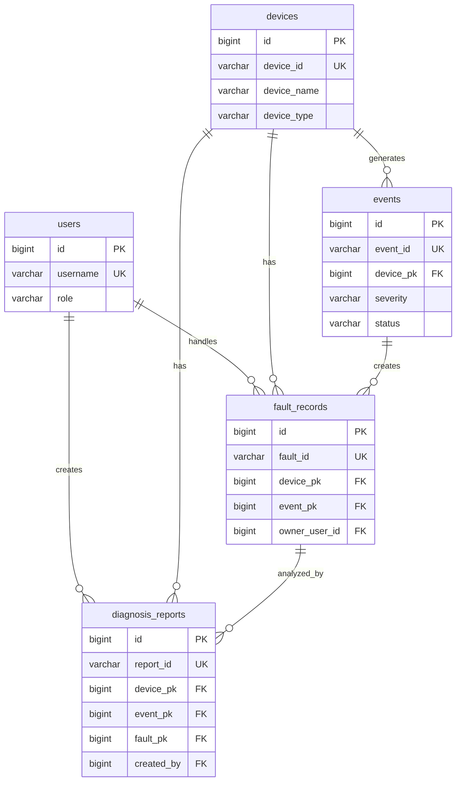

# DeviceOps 详细设计文档

| 文档项 | 内容 |
| --- | --- |
| 项目名称 | DeviceOps |
| 当前阶段 | Phase 3：详细设计 |
| 输入文档 | docs/01_requirement.md、docs/02_architecture.md |
| 文档版本 | v0.1.0 |
| 目标读者 | Tech Lead、后端工程师、测试工程师、运维工程师 |
| 文档状态 | 初稿 |

## 1. 设计范围

本阶段在系统架构设计基础上，输出可指导开发的详细设计，覆盖：

- MySQL 业务表设计、ER 关系说明和建表 SQL。
- Redis 实时状态、在线状态和任务状态 Key 设计。
- Elasticsearch 日志索引结构。
- MQTT 设备消息协议。
- RabbitMQ 交换机、队列、路由键和消息格式。
- brpc + protobuf RPC 接口契约，proto 文件保存于 `proto/` 目录。

本阶段仍属于设计阶段，不实现 C++ 业务代码。

## 2. MySQL 数据库设计

### 2.1 设计原则

- 使用 `BIGINT UNSIGNED` 作为内部主键，便于后续雪花 ID 或数据库自增策略演进。
- 使用 `device_id` 作为设备业务唯一标识，对外暴露时优先使用业务 ID。
- 所有核心表保留 `created_at`、`updated_at`，需要软删除的表保留 `deleted_at`。
- 事件、故障记录、诊断报告形成可追踪链路：设备 -> 事件 -> 故障记录 -> 诊断报告。
- MVP 阶段先覆盖核心表，不展开复杂权限、多租户、工单审批等能力。

### 2.2 ER 关系说明



关系说明：

- `devices` 是设备主数据表，`device_id` 为全局唯一设备业务标识。
- `users` 是平台用户表，MVP 阶段用 `role` 区分运维工程师、开发工程师、系统管理员。
- `events` 是异常事件表，一条设备异常、离线或错误码命中会生成一条事件。
- `fault_records` 是工程师处理故障的业务记录，可由事件转化而来，也可人工创建。
- `diagnosis_reports` 是 AI 或人工辅助诊断报告，关联设备、事件、故障记录和创建人。

### 2.3 表设计

#### 2.3.1 设备表：devices

| 字段 | 类型 | 约束 | 说明 |
| --- | --- | --- | --- |
| id | BIGINT UNSIGNED | PK | 内部主键 |
| device_id | VARCHAR(64) | NOT NULL, UNIQUE | 设备业务 ID |
| device_name | VARCHAR(128) | NOT NULL | 设备名称 |
| device_type | VARCHAR(64) | NOT NULL | 设备类型，如 robot、industrial、terminal |
| model | VARCHAR(128) | NULL | 设备型号 |
| manufacturer | VARCHAR(128) | NULL | 厂商 |
| location | VARCHAR(255) | NULL | 安装位置 |
| status | VARCHAR(32) | NOT NULL | enabled、disabled、maintenance |
| access_token_hash | VARCHAR(255) | NULL | 设备接入凭据摘要 |
| protocol | VARCHAR(32) | NOT NULL | mqtt |
| description | VARCHAR(512) | NULL | 备注 |
| created_at | DATETIME(3) | NOT NULL | 创建时间 |
| updated_at | DATETIME(3) | NOT NULL | 更新时间 |
| deleted_at | DATETIME(3) | NULL | 软删除时间 |

#### 2.3.2 用户表：users

| 字段 | 类型 | 约束 | 说明 |
| --- | --- | --- | --- |
| id | BIGINT UNSIGNED | PK | 内部主键 |
| username | VARCHAR(64) | NOT NULL, UNIQUE | 登录用户名 |
| display_name | VARCHAR(128) | NOT NULL | 展示名称 |
| password_hash | VARCHAR(255) | NOT NULL | 密码摘要 |
| role | VARCHAR(32) | NOT NULL | ops_engineer、dev_engineer、admin |
| email | VARCHAR(128) | NULL | 邮箱 |
| phone | VARCHAR(32) | NULL | 手机号 |
| status | VARCHAR(32) | NOT NULL | active、disabled |
| last_login_at | DATETIME(3) | NULL | 最近登录时间 |
| created_at | DATETIME(3) | NOT NULL | 创建时间 |
| updated_at | DATETIME(3) | NOT NULL | 更新时间 |
| deleted_at | DATETIME(3) | NULL | 软删除时间 |

#### 2.3.3 事件表：events

| 字段 | 类型 | 约束 | 说明 |
| --- | --- | --- | --- |
| id | BIGINT UNSIGNED | PK | 内部主键 |
| event_id | VARCHAR(64) | NOT NULL, UNIQUE | 事件业务 ID |
| device_pk | BIGINT UNSIGNED | NOT NULL, FK | 关联设备内部主键 |
| device_id | VARCHAR(64) | NOT NULL | 冗余设备业务 ID，便于查询 |
| event_type | VARCHAR(64) | NOT NULL | temperature_high、error_code、offline |
| severity | VARCHAR(32) | NOT NULL | info、warning、critical |
| status | VARCHAR(32) | NOT NULL | open、processing、resolved、closed |
| error_code | VARCHAR(64) | NULL | 设备错误码 |
| title | VARCHAR(255) | NOT NULL | 事件标题 |
| description | TEXT | NULL | 事件描述 |
| metric_snapshot | JSON | NULL | 触发时指标快照 |
| rule_name | VARCHAR(128) | NULL | 命中规则名称 |
| occurred_at | DATETIME(3) | NOT NULL | 发生时间 |
| resolved_at | DATETIME(3) | NULL | 恢复时间 |
| created_at | DATETIME(3) | NOT NULL | 创建时间 |
| updated_at | DATETIME(3) | NOT NULL | 更新时间 |

#### 2.3.4 故障记录表：fault_records

| 字段 | 类型 | 约束 | 说明 |
| --- | --- | --- | --- |
| id | BIGINT UNSIGNED | PK | 内部主键 |
| fault_id | VARCHAR(64) | NOT NULL, UNIQUE | 故障业务 ID |
| device_pk | BIGINT UNSIGNED | NOT NULL, FK | 关联设备 |
| device_id | VARCHAR(64) | NOT NULL | 设备业务 ID |
| event_pk | BIGINT UNSIGNED | NULL, FK | 关联事件 |
| event_id | VARCHAR(64) | NULL | 事件业务 ID |
| owner_user_id | BIGINT UNSIGNED | NULL, FK | 处理人 |
| fault_type | VARCHAR(64) | NOT NULL | 故障类型 |
| severity | VARCHAR(32) | NOT NULL | warning、critical |
| status | VARCHAR(32) | NOT NULL | new、processing、resolved、closed |
| symptom | TEXT | NOT NULL | 故障现象 |
| root_cause | TEXT | NULL | 根因分析 |
| solution | TEXT | NULL | 处理措施 |
| started_at | DATETIME(3) | NOT NULL | 故障开始时间 |
| resolved_at | DATETIME(3) | NULL | 故障解决时间 |
| created_at | DATETIME(3) | NOT NULL | 创建时间 |
| updated_at | DATETIME(3) | NOT NULL | 更新时间 |

#### 2.3.5 诊断报告表：diagnosis_reports

| 字段 | 类型 | 约束 | 说明 |
| --- | --- | --- | --- |
| id | BIGINT UNSIGNED | PK | 内部主键 |
| report_id | VARCHAR(64) | NOT NULL, UNIQUE | 报告业务 ID |
| device_pk | BIGINT UNSIGNED | NOT NULL, FK | 关联设备 |
| device_id | VARCHAR(64) | NOT NULL | 设备业务 ID |
| event_pk | BIGINT UNSIGNED | NULL, FK | 关联事件 |
| event_id | VARCHAR(64) | NULL | 事件业务 ID |
| fault_pk | BIGINT UNSIGNED | NULL, FK | 关联故障记录 |
| fault_id | VARCHAR(64) | NULL | 故障业务 ID |
| created_by | BIGINT UNSIGNED | NULL, FK | 创建人 |
| report_type | VARCHAR(32) | NOT NULL | ai、manual、mixed |
| status | VARCHAR(32) | NOT NULL | draft、confirmed、rejected |
| summary | TEXT | NOT NULL | 诊断摘要 |
| possible_causes | JSON | NULL | 可能原因列表 |
| recommended_actions | JSON | NULL | 推荐排查步骤 |
| evidence | JSON | NULL | 关联证据 |
| ai_model | VARCHAR(128) | NULL | 使用的模型或 Agent 名称 |
| confidence | DECIMAL(5,4) | NULL | 置信度 |
| created_at | DATETIME(3) | NOT NULL | 创建时间 |
| updated_at | DATETIME(3) | NOT NULL | 更新时间 |

### 2.4 建表 SQL

```sql
CREATE TABLE devices (
    id BIGINT UNSIGNED NOT NULL AUTO_INCREMENT,
    device_id VARCHAR(64) NOT NULL,
    device_name VARCHAR(128) NOT NULL,
    device_type VARCHAR(64) NOT NULL,
    model VARCHAR(128) NULL,
    manufacturer VARCHAR(128) NULL,
    location VARCHAR(255) NULL,
    status VARCHAR(32) NOT NULL DEFAULT 'enabled',
    access_token_hash VARCHAR(255) NULL,
    protocol VARCHAR(32) NOT NULL DEFAULT 'mqtt',
    description VARCHAR(512) NULL,
    created_at DATETIME(3) NOT NULL DEFAULT CURRENT_TIMESTAMP(3),
    updated_at DATETIME(3) NOT NULL DEFAULT CURRENT_TIMESTAMP(3) ON UPDATE CURRENT_TIMESTAMP(3),
    deleted_at DATETIME(3) NULL,
    PRIMARY KEY (id),
    UNIQUE KEY uk_devices_device_id (device_id),
    KEY idx_devices_type_status (device_type, status),
    KEY idx_devices_location (location)
) ENGINE=InnoDB DEFAULT CHARSET=utf8mb4 COLLATE=utf8mb4_unicode_ci;

CREATE TABLE users (
    id BIGINT UNSIGNED NOT NULL AUTO_INCREMENT,
    username VARCHAR(64) NOT NULL,
    display_name VARCHAR(128) NOT NULL,
    password_hash VARCHAR(255) NOT NULL,
    role VARCHAR(32) NOT NULL,
    email VARCHAR(128) NULL,
    phone VARCHAR(32) NULL,
    status VARCHAR(32) NOT NULL DEFAULT 'active',
    last_login_at DATETIME(3) NULL,
    created_at DATETIME(3) NOT NULL DEFAULT CURRENT_TIMESTAMP(3),
    updated_at DATETIME(3) NOT NULL DEFAULT CURRENT_TIMESTAMP(3) ON UPDATE CURRENT_TIMESTAMP(3),
    deleted_at DATETIME(3) NULL,
    PRIMARY KEY (id),
    UNIQUE KEY uk_users_username (username),
    KEY idx_users_role_status (role, status)
) ENGINE=InnoDB DEFAULT CHARSET=utf8mb4 COLLATE=utf8mb4_unicode_ci;

CREATE TABLE events (
    id BIGINT UNSIGNED NOT NULL AUTO_INCREMENT,
    event_id VARCHAR(64) NOT NULL,
    device_pk BIGINT UNSIGNED NOT NULL,
    device_id VARCHAR(64) NOT NULL,
    event_type VARCHAR(64) NOT NULL,
    severity VARCHAR(32) NOT NULL,
    status VARCHAR(32) NOT NULL DEFAULT 'open',
    error_code VARCHAR(64) NULL,
    title VARCHAR(255) NOT NULL,
    description TEXT NULL,
    metric_snapshot JSON NULL,
    rule_name VARCHAR(128) NULL,
    occurred_at DATETIME(3) NOT NULL,
    resolved_at DATETIME(3) NULL,
    created_at DATETIME(3) NOT NULL DEFAULT CURRENT_TIMESTAMP(3),
    updated_at DATETIME(3) NOT NULL DEFAULT CURRENT_TIMESTAMP(3) ON UPDATE CURRENT_TIMESTAMP(3),
    PRIMARY KEY (id),
    UNIQUE KEY uk_events_event_id (event_id),
    KEY idx_events_device_time (device_id, occurred_at),
    KEY idx_events_status_severity (status, severity),
    KEY idx_events_type_time (event_type, occurred_at),
    CONSTRAINT fk_events_device_pk
        FOREIGN KEY (device_pk) REFERENCES devices (id)
) ENGINE=InnoDB DEFAULT CHARSET=utf8mb4 COLLATE=utf8mb4_unicode_ci;

CREATE TABLE fault_records (
    id BIGINT UNSIGNED NOT NULL AUTO_INCREMENT,
    fault_id VARCHAR(64) NOT NULL,
    device_pk BIGINT UNSIGNED NOT NULL,
    device_id VARCHAR(64) NOT NULL,
    event_pk BIGINT UNSIGNED NULL,
    event_id VARCHAR(64) NULL,
    owner_user_id BIGINT UNSIGNED NULL,
    fault_type VARCHAR(64) NOT NULL,
    severity VARCHAR(32) NOT NULL,
    status VARCHAR(32) NOT NULL DEFAULT 'new',
    symptom TEXT NOT NULL,
    root_cause TEXT NULL,
    solution TEXT NULL,
    started_at DATETIME(3) NOT NULL,
    resolved_at DATETIME(3) NULL,
    created_at DATETIME(3) NOT NULL DEFAULT CURRENT_TIMESTAMP(3),
    updated_at DATETIME(3) NOT NULL DEFAULT CURRENT_TIMESTAMP(3) ON UPDATE CURRENT_TIMESTAMP(3),
    PRIMARY KEY (id),
    UNIQUE KEY uk_fault_records_fault_id (fault_id),
    KEY idx_fault_records_device_time (device_id, started_at),
    KEY idx_fault_records_status_severity (status, severity),
    KEY idx_fault_records_event_id (event_id),
    CONSTRAINT fk_fault_records_device_pk
        FOREIGN KEY (device_pk) REFERENCES devices (id),
    CONSTRAINT fk_fault_records_event_pk
        FOREIGN KEY (event_pk) REFERENCES events (id),
    CONSTRAINT fk_fault_records_owner_user_id
        FOREIGN KEY (owner_user_id) REFERENCES users (id)
) ENGINE=InnoDB DEFAULT CHARSET=utf8mb4 COLLATE=utf8mb4_unicode_ci;

CREATE TABLE diagnosis_reports (
    id BIGINT UNSIGNED NOT NULL AUTO_INCREMENT,
    report_id VARCHAR(64) NOT NULL,
    device_pk BIGINT UNSIGNED NOT NULL,
    device_id VARCHAR(64) NOT NULL,
    event_pk BIGINT UNSIGNED NULL,
    event_id VARCHAR(64) NULL,
    fault_pk BIGINT UNSIGNED NULL,
    fault_id VARCHAR(64) NULL,
    created_by BIGINT UNSIGNED NULL,
    report_type VARCHAR(32) NOT NULL DEFAULT 'ai',
    status VARCHAR(32) NOT NULL DEFAULT 'draft',
    summary TEXT NOT NULL,
    possible_causes JSON NULL,
    recommended_actions JSON NULL,
    evidence JSON NULL,
    ai_model VARCHAR(128) NULL,
    confidence DECIMAL(5,4) NULL,
    created_at DATETIME(3) NOT NULL DEFAULT CURRENT_TIMESTAMP(3),
    updated_at DATETIME(3) NOT NULL DEFAULT CURRENT_TIMESTAMP(3) ON UPDATE CURRENT_TIMESTAMP(3),
    PRIMARY KEY (id),
    UNIQUE KEY uk_diagnosis_reports_report_id (report_id),
    KEY idx_diagnosis_reports_device_time (device_id, created_at),
    KEY idx_diagnosis_reports_event_id (event_id),
    KEY idx_diagnosis_reports_fault_id (fault_id),
    KEY idx_diagnosis_reports_status (status),
    CONSTRAINT fk_diagnosis_reports_device_pk
        FOREIGN KEY (device_pk) REFERENCES devices (id),
    CONSTRAINT fk_diagnosis_reports_event_pk
        FOREIGN KEY (event_pk) REFERENCES events (id),
    CONSTRAINT fk_diagnosis_reports_fault_pk
        FOREIGN KEY (fault_pk) REFERENCES fault_records (id),
    CONSTRAINT fk_diagnosis_reports_created_by
        FOREIGN KEY (created_by) REFERENCES users (id)
) ENGINE=InnoDB DEFAULT CHARSET=utf8mb4 COLLATE=utf8mb4_unicode_ci;
```

## 3. Redis 设计

### 3.1 Key 命名规范

```text
deviceops:{domain}:{object}:{id}
```

约定：

- Key 使用小写英文和冒号分隔。
- JSON Value 使用 UTF-8 字符串，字段名使用 snake_case。
- 高频状态类 Key 设置 TTL，避免离线设备长期占用内存。

### 3.2 设备实时状态缓存

Key：

```text
deviceops:device:status:{device_id}
```

类型：String JSON

TTL：300 秒，设备每次状态或心跳上报后刷新。

Value 示例：

```json
{
  "device_id": "robot-001",
  "online": true,
  "battery": 86.5,
  "temperature": 42.3,
  "speed": 1.2,
  "run_mode": "auto",
  "error_code": "",
  "last_telemetry_at": 1720000000000,
  "updated_at": 1720000000000
}
```

使用方：

- `telemetry-service` 写入。
- `telemetry-service` 和 `diagnosis-service` 查询。
- Qt 客户端通过 `telemetry-service` 间接读取。

### 3.3 在线状态

Key：

```text
deviceops:device:online:{device_id}
```

类型：String

TTL：90 秒，心跳上报后刷新。

Value 示例：

```text
1
```

说明：

- Key 存在且值为 `1` 表示设备在线。
- Key 过期表示设备疑似离线，由 `telemetry-service` 产生离线候选事件。

### 3.4 任务状态

Key：

```text
deviceops:task:{task_id}
```

类型：Hash

TTL：24 小时，任务完成后保留短期查询窗口。

字段：

| 字段 | 说明 |
| --- | --- |
| task_id | 任务 ID |
| task_type | diagnosis、knowledge_index、log_index |
| status | pending、running、success、failed |
| progress | 0-100 |
| ref_id | 关联事件、报告或知识文档 ID |
| error_message | 失败原因 |
| created_at | 创建时间戳 |
| updated_at | 更新时间戳 |

示例：

```text
HSET deviceops:task:task-20260712-0001 task_id task-20260712-0001 task_type diagnosis status running progress 40 ref_id evt-001 updated_at 1720000000000
```

## 4. Elasticsearch 设计

### 4.1 日志索引命名

按月滚动索引：

```text
deviceops-logs-YYYY.MM
```

示例：

```text
deviceops-logs-2026.07
```

### 4.2 日志文档结构

| 字段 | 类型 | 说明 |
| --- | --- | --- |
| log_id | keyword | 日志 ID |
| trace_id | keyword | 链路追踪 ID |
| device_id | keyword | 设备 ID |
| service_name | keyword | 服务名称 |
| source_type | keyword | device、service、gateway |
| level | keyword | debug、info、warn、error |
| message | text | 日志正文 |
| error_code | keyword | 设备或服务错误码 |
| event_id | keyword | 关联事件 ID |
| tags | keyword | 标签 |
| context | object | 扩展上下文 |
| timestamp | date | 日志时间 |
| ingested_at | date | 写入 ES 时间 |

### 4.3 Mapping

```json
{
  "settings": {
    "number_of_shards": 1,
    "number_of_replicas": 0,
    "index.lifecycle.name": "deviceops-logs-policy"
  },
  "mappings": {
    "dynamic": true,
    "properties": {
      "log_id": { "type": "keyword" },
      "trace_id": { "type": "keyword" },
      "device_id": { "type": "keyword" },
      "service_name": { "type": "keyword" },
      "source_type": { "type": "keyword" },
      "level": { "type": "keyword" },
      "message": {
        "type": "text",
        "fields": {
          "keyword": {
            "type": "keyword",
            "ignore_above": 256
          }
        }
      },
      "error_code": { "type": "keyword" },
      "event_id": { "type": "keyword" },
      "tags": { "type": "keyword" },
      "context": { "type": "object", "enabled": true },
      "timestamp": { "type": "date" },
      "ingested_at": { "type": "date" }
    }
  }
}
```

## 5. MQTT 协议设计

### 5.1 通用约定

- Payload 使用 JSON，便于设备模拟器和调试阶段快速验证。
- 时间字段统一使用 Unix 毫秒时间戳。
- 消息必须包含 `message_id`、`device_id`、`timestamp`。
- 设备认证通过 MQTT 用户名、密码或 token 完成，payload 中不传明文凭据。

### 5.2 设备注册消息

Topic：

```text
device/{device_id}/register
```

方向：设备 -> 平台

QoS：1

Payload：

```json
{
  "message_id": "msg-20260712-0001",
  "device_id": "robot-001",
  "timestamp": 1720000000000,
  "device_name": "仓储机器人001",
  "device_type": "robot",
  "model": "RBT-A1",
  "manufacturer": "DeviceOpsLab",
  "firmware_version": "1.0.0",
  "location": "warehouse-a",
  "capabilities": ["telemetry", "alarm", "log"]
}
```

处理结果：

- `device-gateway` 接收并校验消息。
- 已存在设备则更新接入信息和最后注册时间。
- 不存在设备时，MVP 阶段可按系统配置决定自动创建或拒绝接入。

### 5.3 状态上传消息

Topic：

```text
device/{device_id}/telemetry
```

方向：设备 -> 平台

QoS：0 或 1。MVP 阶段建议 QoS 1，降低关键状态丢失概率。

Payload：

```json
{
  "message_id": "msg-20260712-0002",
  "device_id": "robot-001",
  "timestamp": 1720000001000,
  "battery": 86.5,
  "temperature": 42.3,
  "speed": 1.2,
  "run_mode": "auto",
  "online": true,
  "error_code": "",
  "metrics": {
    "motor_current": 3.2,
    "cpu_usage": 0.47
  }
}
```

处理结果：

- `device-gateway` 标准化为内部遥测消息。
- `telemetry-service` 更新 Redis 实时状态。
- 状态变化消息投递 RabbitMQ。

### 5.4 报警消息

Topic：

```text
device/{device_id}/alarm
```

方向：设备 -> 平台

QoS：1

Payload：

```json
{
  "message_id": "msg-20260712-0003",
  "device_id": "robot-001",
  "timestamp": 1720000002000,
  "alarm_type": "temperature_high",
  "severity": "critical",
  "error_code": "TEMP_001",
  "title": "设备温度过高",
  "description": "主控模块温度超过阈值",
  "metrics": {
    "temperature": 88.6,
    "battery": 74.2,
    "speed": 0.8
  }
}
```

处理结果：

- `device-gateway` 校验设备身份并投递告警候选消息。
- `event-service` 根据规则创建或合并告警事件。
- 告警事件写入 MySQL 和 Elasticsearch。

## 6. RabbitMQ 设计

### 6.1 交换机设计

| 交换机 | 类型 | 说明 |
| --- | --- | --- |
| deviceops.telemetry.exchange | topic | 设备状态与心跳消息 |
| deviceops.event.exchange | topic | 告警和事件消息 |
| deviceops.log.exchange | topic | 日志写入消息 |
| deviceops.diagnosis.exchange | topic | 诊断任务消息 |
| deviceops.knowledge.exchange | topic | 知识库索引任务消息 |

### 6.2 队列设计

| 队列 | 绑定交换机 | Routing Key | 消费者 |
| --- | --- | --- | --- |
| telemetry.status.queue | deviceops.telemetry.exchange | telemetry.status.updated | telemetry-service、event-service |
| telemetry.offline.queue | deviceops.telemetry.exchange | telemetry.device.offline | event-service |
| event.alarm.queue | deviceops.event.exchange | event.alarm.created | diagnosis-service、log-service |
| log.ingest.queue | deviceops.log.exchange | log.device.received | log-service |
| diagnosis.task.queue | deviceops.diagnosis.exchange | diagnosis.task.created | diagnosis-service |
| knowledge.index.queue | deviceops.knowledge.exchange | knowledge.document.index_requested | knowledge-service |

### 6.3 通用消息格式

所有 RabbitMQ 消息使用 JSON，通用 Envelope 如下：

```json
{
  "message_id": "mq-20260712-0001",
  "message_type": "telemetry.status.updated",
  "trace_id": "trace-001",
  "source": "telemetry-service",
  "timestamp": 1720000000000,
  "payload": {}
}
```

### 6.4 状态更新消息

Routing Key：

```text
telemetry.status.updated
```

Payload：

```json
{
  "device_id": "robot-001",
  "battery": 86.5,
  "temperature": 42.3,
  "speed": 1.2,
  "run_mode": "auto",
  "error_code": "",
  "reported_at": 1720000001000
}
```

### 6.5 告警创建消息

Routing Key：

```text
event.alarm.created
```

Payload：

```json
{
  "event_id": "evt-20260712-0001",
  "device_id": "robot-001",
  "event_type": "temperature_high",
  "severity": "critical",
  "title": "设备温度过高",
  "occurred_at": 1720000002000
}
```

### 6.6 诊断任务消息

Routing Key：

```text
diagnosis.task.created
```

Payload：

```json
{
  "task_id": "task-20260712-0001",
  "event_id": "evt-20260712-0001",
  "device_id": "robot-001",
  "requested_by": "user-001",
  "created_at": 1720000003000
}
```

## 7. Protobuf RPC 设计

### 7.1 文件清单

proto 文件保存于 `proto/`：

- `proto/common.proto`：通用响应、分页、时间范围和枚举。
- `proto/device.proto`：设备管理 RPC。
- `proto/telemetry.proto`：设备状态 RPC。
- `proto/event.proto`：事件告警 RPC。
- `proto/log.proto`：日志检索 RPC。
- `proto/diagnosis.proto`：故障记录和诊断报告 RPC。
- `proto/knowledge.proto`：知识库检索 RPC。

### 7.2 RPC 服务边界

| proto | 服务 | 说明 |
| --- | --- | --- |
| device.proto | DeviceService | 管理设备基础信息，校验设备接入 |
| telemetry.proto | TelemetryService | 写入和查询设备实时状态 |
| event.proto | EventService | 查询和更新告警事件 |
| log.proto | LogService | 写入和查询日志 |
| diagnosis.proto | DiagnosisService | 管理故障记录，发起 AI 诊断，查询诊断报告 |
| knowledge.proto | KnowledgeService | 管理和检索知识文档 |

### 7.3 brpc 约定

- proto 使用 `syntax = "proto3"`。
- C++ 服务端基于 brpc 生成的 protobuf service 实现。
- 所有响应包含 `CommonResponse`，用于表达业务状态。
- 查询接口统一使用 `PageRequest` 和 `PageResponse`。
- 时间字段统一使用 Unix 毫秒时间戳 `int64`。

## 8. 后续实现建议

- Phase 4 设备模拟器实现前，应优先确认 MQTT topic 和 telemetry payload。
- Phase 5 device-gateway 实现前，应确认 MQTT Client 封装位置，并复用脚手架日志、配置、注册发现能力。
- Phase 6 事件告警实现前，应补充告警规则配置表或配置文件方案。
- Phase 7 Agent 诊断实现前，应补充知识库分段、向量化和模型调用细节。

