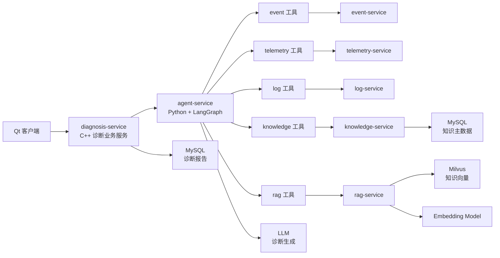
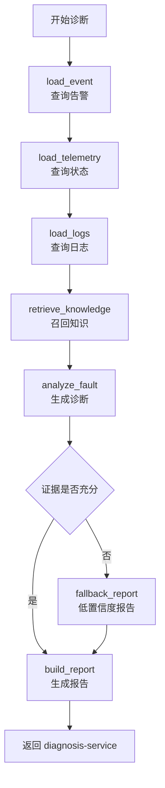

# DeviceOps Agent/RAG 增强设计文档

| 文档项 | 内容 |
| --- | --- |
| 项目名称 | DeviceOps |
| 文档目的 | 指导后续实现 Python Agent 服务和增强版 RAG 能力 |
| 适用阶段 | Agent/RAG 能力增强阶段 |
| 目标读者 | 后端工程师、AI 工程师、架构师、面试讲解准备 |
| 关联服务 | diagnosis-service、agent-service、rag-service、knowledge-service |
| 技术方向 | Python、LangGraph、LangChain、RAG、Milvus、HTTP JSON |

## 1. 当前现状

当前项目中已经有基础的 RAG MVP，但还没有真正独立的 Agent 模块。

已有实现：

```text
services/rag_service/server.py
services/knowledge_service/
services/diagnosis_service/
```

当前链路：

```text
diagnosis-service
  -> 调用 rag-service /diagnose
  -> rag-service 返回简单诊断摘要
  -> diagnosis-service 保存诊断报告
```

当前 `rag-service` 能力：

- `/index`：接收知识文档，进行内存切片。
- `/retrieve`：基于关键词、设备类型、错误码做简单打分检索。
- `/diagnose`：根据传入的事件、知识片段和日志生成简单诊断草案。

当前不足：

- 没有独立 `agent-service`。
- 没有 LangGraph 工作流。
- 没有工具调用编排。
- 没有真正的语义向量检索。
- 没有 Milvus 落地。
- 诊断报告结构化程度不够。
- 诊断依据、知识引用和日志证据不够清晰。

因此，后续应把 Agent 和 RAG 从“简单诊断函数”演进为“故障诊断上下文引擎”。

## 2. 设计目标

Agent/RAG 增强的目标不是做一个通用聊天机器人，而是服务于设备故障诊断场景。

核心目标：

- 支持从告警事件发起诊断。
- 自动聚合设备状态、告警详情、相关日志和知识库片段。
- 基于 LangGraph 编排多步骤诊断流程。
- 基于 RAG 检索设备手册、错误码说明、维修 SOP 和历史案例。
- 输出结构化、可解释、带证据来源的诊断报告。
- 保持 C++ 微服务边界稳定，不破坏现有后端架构。

目标链路：

```text
Qt 客户端
  -> diagnosis-service
      -> agent-service
          -> telemetry-service
          -> event-service
          -> log-service
          -> knowledge-service
          -> rag-service
      -> diagnosis-service 保存诊断报告
```

## 3. 服务职责边界

### 3.1 diagnosis-service

技术栈：C++17、brpc、protobuf、MySQL。

职责：

- 作为诊断业务入口。
- 管理故障记录。
- 接收 Qt 客户端发起的诊断请求。
- 调用 `agent-service` 获取诊断结果。
- 保存诊断报告。
- 提供诊断报告查询、确认、驳回接口。

不负责：

- 不直接执行 Agent 编排。
- 不直接调用大模型。
- 不直接管理向量索引。
- 不直接生成复杂诊断推理过程。

### 3.2 agent-service

技术栈：Python、FastAPI、LangGraph、LangChain。

建议目录：

```text
services/agent_service/
  README.md
  requirements.txt
  main.py
  app/
    __init__.py
    config.py
    schemas.py
    graph.py
    prompts.py
    llm.py
    clients/
      __init__.py
      brpc_http_client.py
      rag_client.py
    tools/
      __init__.py
      event_tool.py
      telemetry_tool.py
      log_tool.py
      knowledge_tool.py
      rag_tool.py
    workflows/
      __init__.py
      diagnosis_workflow.py
```

职责：

- 作为 AI 诊断编排中心。
- 使用 LangGraph 定义诊断流程。
- 调用多个工具收集上下文。
- 调用 RAG 检索知识。
- 调用 LLM 或规则模板生成结构化诊断结果。
- 返回诊断草案给 `diagnosis-service`。

不负责：

- 不保存诊断报告到 MySQL。
- 不管理知识文档主数据。
- 不直接接收设备 MQTT 消息。
- 不代替 `diagnosis-service` 成为业务入口。

### 3.3 rag-service

技术栈：Python、FastAPI、Embedding、Milvus、可选 rerank。

职责：

- 知识文档切片。
- 文本 embedding。
- 向量索引写入 Milvus。
- 关键词和向量混合检索。
- 返回带来源的知识片段。
- 可选提供 RAG 生成能力。

不负责：

- 不决定故障诊断流程。
- 不调用 telemetry、event、log 等业务服务。
- 不保存诊断报告。

### 3.4 knowledge-service

技术栈：C++17、brpc、protobuf、MySQL。

职责：

- 管理知识文档元数据。
- 管理知识文档内容。
- 提供知识文档创建、查询、列表、关键词检索。
- 触发 RAG 索引。

不负责：

- 不执行 Agent 编排。
- 不直接生成诊断报告。
- 不承担向量数据库检索细节。

## 4. 总体架构



## 5. Agent 工作流设计

### 5.1 LangGraph 状态定义

Agent 的状态应包含一次诊断所需的完整上下文。

```python
class DiagnosisState(TypedDict):
    request_id: str
    event_id: str
    fault_id: str
    device_id: str
    engineer_note: str

    event: dict
    telemetry: dict
    logs: list[dict]
    knowledge_snippets: list[dict]

    diagnosis_summary: str
    possible_causes: list[str]
    recommended_actions: list[str]
    evidence: list[dict]
    confidence: float
    risk_level: str
```

### 5.2 LangGraph 节点

建议节点：

```text
load_event
  加载告警事件详情

load_telemetry
  查询设备最近实时状态和关键指标

load_logs
  查询故障时间窗口内的设备日志和服务日志

retrieve_knowledge
  基于错误码、设备类型、故障描述检索知识片段

analyze_fault
  生成可能原因、排查步骤和风险提示

verify_evidence
  检查诊断结果是否有足够证据支撑

build_report
  输出结构化诊断报告
```

### 5.3 工作流



### 5.4 分支策略

可根据事件类型进入不同策略：

| 事件类型 | 诊断策略 |
| --- | --- |
| 温度过高 | 优先查询温度历史、散热相关知识、最近过热日志 |
| 错误码上报 | 优先按错误码精确检索知识库 |
| 设备离线 | 优先查询心跳、Redis 在线状态、MQTT gateway 转发统计 |
| 通信异常 | 优先查询 gateway 日志、MQTT 连接状态、网络类 SOP |
| 未知异常 | 使用通用日志上下文 + 语义检索 |

## 6. 工具调用设计

Agent 工具不直接访问数据库，只调用现有后端服务接口。

### 6.1 event_tool

职责：

- 根据 `event_id` 查询告警详情。
- 获取事件类型、严重级别、错误码、发生时间、指标快照。

输入：

```json
{
  "event_id": "evt-xxx"
}
```

输出：

```json
{
  "event_id": "evt-xxx",
  "device_id": "robot-001",
  "event_type": "temperature_high",
  "severity": "critical",
  "error_code": "TEMP_001",
  "title": "device temperature high",
  "occurred_at": 1783951186667
}
```

### 6.2 telemetry_tool

职责：

- 查询设备实时状态。
- 查询设备故障前后的历史状态。

输入：

```json
{
  "device_id": "robot-001",
  "start_time": 1783950886667,
  "end_time": 1783951186667
}
```

输出：

```json
{
  "device_id": "robot-001",
  "online": true,
  "battery": 86.3,
  "temperature": 86.6,
  "error_code": "TEMP_001",
  "last_seen_at": 1783951186667
}
```

### 6.3 log_tool

职责：

- 根据设备、事件、错误码和时间窗口查询相关日志。
- 为诊断提供原始证据。

输入：

```json
{
  "device_id": "robot-001",
  "error_code": "TEMP_001",
  "start_time": 1783950886667,
  "end_time": 1783951186667,
  "limit": 20
}
```

输出：

```json
[
  {
    "timestamp": 1783951170000,
    "level": "WARN",
    "service_name": "device-gateway",
    "message": "device temperature exceeds threshold",
    "error_code": "TEMP_001"
  }
]
```

### 6.4 knowledge_tool

职责：

- 调用 `knowledge-service` 获取知识文档元数据。
- 支持按错误码、设备类型、关键词检索。

### 6.5 rag_tool

职责：

- 调用 `rag-service /retrieve` 召回知识片段。
- 后续支持向量检索、混合检索和 rerank。

输入：

```json
{
  "query": "robot temperature high TEMP_001",
  "device_type": "robot",
  "error_code": "TEMP_001",
  "top_k": 5
}
```

输出：

```json
{
  "snippets": [
    {
      "chunk_id": "doc-temp-001#chunk-2",
      "document_id": "doc-temp-001",
      "title": "机器人温度过高处理 SOP",
      "content": "当温度超过阈值时，优先检查散热风扇、负载和环境温度...",
      "score": 0.87,
      "metadata": {
        "device_type": "robot",
        "error_code": "TEMP_001",
        "category": "temperature"
      }
    }
  ]
}
```

## 7. HTTP 接口设计

### 7.1 agent-service

默认端口：

```text
9800
```

环境变量：

```bash
DEVICEOPS_AGENT_HOST=0.0.0.0
DEVICEOPS_AGENT_PORT=9800
DEVICEOPS_AGENT_LLM_PROVIDER=mock
DEVICEOPS_AGENT_LLM_MODEL=deviceops-diagnosis-agent
DEVICEOPS_AGENT_TIMEOUT_MS=30000
DEVICEOPS_EVENT_SERVICE_URL=http://127.0.0.1:9401
DEVICEOPS_TELEMETRY_SERVICE_URL=http://127.0.0.1:9301
DEVICEOPS_LOG_SERVICE_URL=http://127.0.0.1:9501
DEVICEOPS_KNOWLEDGE_SERVICE_URL=http://127.0.0.1:9600
DEVICEOPS_RAG_SERVICE_URL=http://127.0.0.1:9601
```

#### GET /health

返回：

```json
{
  "status": "ok",
  "service": "agent-service",
  "graph": "diagnosis-workflow",
  "llm_provider": "mock"
}
```

#### POST /diagnose

请求：

```json
{
  "request_id": "diag-req-001",
  "event_id": "evt-001",
  "fault_id": "fault-001",
  "device_id": "robot-001",
  "engineer_note": "设备高温后出现运行异常"
}
```

响应：

```json
{
  "request_id": "diag-req-001",
  "summary": "设备疑似因温度过高导致运行异常，建议优先检查散热和负载情况。",
  "possible_causes": [
    "设备散热能力不足",
    "设备长时间高负载运行",
    "环境温度过高",
    "温度传感器异常"
  ],
  "recommended_actions": [
    "检查风扇和散热通道",
    "查看故障发生前 10 分钟温度曲线",
    "确认是否存在持续高负载任务",
    "根据 TEMP_001 SOP 执行降温处理"
  ],
  "evidence": [
    {
      "type": "event",
      "source": "event-service",
      "id": "evt-001",
      "title": "device temperature high"
    },
    {
      "type": "knowledge",
      "source": "rag-service",
      "id": "doc-temp-001#chunk-2",
      "title": "机器人温度过高处理 SOP"
    }
  ],
  "confidence": 0.78,
  "risk_level": "high",
  "model": "deviceops-diagnosis-agent"
}
```

### 7.2 rag-service 增强接口

当前已有：

```text
GET  /health
POST /index
POST /retrieve
POST /diagnose
```

建议后续演进：

```text
POST /documents/index
POST /chunks/retrieve
POST /diagnosis/generate
POST /rerank
```

为了兼容当前项目，第一阶段可以保留原接口，只增强内部实现和返回字段。

## 8. RAG 检索增强设计

### 8.1 文档处理流程

```text
知识文档
  -> 文本清洗
  -> 分段切片
  -> metadata 补充
  -> embedding 向量化
  -> 写入 Milvus
  -> chunk 元数据写入 MySQL 或本地索引
```

### 8.2 Chunk 元数据

每个 chunk 至少包含：

```json
{
  "chunk_id": "doc-001#chunk-1",
  "document_id": "doc-001",
  "title": "机器人通信故障处理 SOP",
  "content": "...",
  "device_type": "robot",
  "error_code": "COMM_001",
  "category": "communication",
  "source": "maintenance_manual",
  "version": "v1.0",
  "created_at": 1783951186667
}
```

### 8.3 混合检索

设备故障诊断不能只依赖向量相似度，应采用混合检索：

```text
最终得分 =
  向量相似度 * 0.5
  + 错误码精确匹配 * 0.25
  + 设备类型匹配 * 0.1
  + 关键词匹配 * 0.1
  + 文档优先级 * 0.05
```

原因：

- 错误码在设备运维场景中具有强确定性。
- 设备类型决定 SOP 是否适用。
- 向量检索适合召回语义相近的历史案例。
- 关键词检索适合明确的日志字段和错误码。

### 8.4 检索结果要求

RAG 返回结果必须带来源：

```json
{
  "chunk_id": "doc-001#chunk-1",
  "document_id": "doc-001",
  "title": "COMM_001 通信故障说明",
  "content": "...",
  "score": 0.91,
  "retrieval_type": "hybrid",
  "metadata": {
    "error_code": "COMM_001",
    "device_type": "robot"
  }
}
```

## 9. 诊断报告结构

Agent 输出应映射到当前 `diagnosis-service` 的报告字段。

建议结构：

```json
{
  "summary": "设备疑似通信链路异常。",
  "possible_causes": [
    "MQTT Broker 连接不稳定",
    "设备网络抖动",
    "设备认证信息异常"
  ],
  "recommended_actions": [
    "检查 device-gateway MQTT 连接状态",
    "检查设备最近心跳",
    "查看 COMM_001 对应 SOP",
    "确认设备 token 是否过期"
  ],
  "evidence": [
    {
      "type": "log",
      "source": "log-service",
      "message": "mqtt connection timeout"
    },
    {
      "type": "knowledge",
      "source": "rag-service",
      "chunk_id": "doc-comm-001#chunk-0"
    }
  ],
  "confidence": 0.82,
  "risk_level": "medium",
  "model": "deviceops-diagnosis-agent"
}
```

关键要求：

- `summary` 不能只有一句泛泛描述，必须结合当前设备和故障。
- `possible_causes` 必须是数组。
- `recommended_actions` 必须是可执行排查步骤。
- `evidence` 必须能追溯到日志、事件或知识片段。
- `confidence` 必须根据证据充足度计算，不能固定写死。

## 10. LLM 策略

### 10.1 MVP 策略

第一阶段可以不接真实大模型，使用规则模板生成结构化报告。

好处：

- 不依赖外部 API。
- 本地演示稳定。
- 便于测试。
- 先把 Agent 工作流和工具调用跑通。

### 10.2 增强策略

第二阶段接入 LLM：

```text
Agent 收集上下文
  -> 构造 prompt
  -> 调用 LLM
  -> 校验 JSON 输出
  -> 修复格式
  -> 返回结构化报告
```

Prompt 要求：

- 明确输出 JSON。
- 禁止编造没有证据的结论。
- 必须引用 evidence。
- 如果证据不足，降低 confidence。
- 输出工程师可执行的排查步骤。

### 10.3 输出校验

LLM 输出必须经过校验：

- JSON 是否可解析。
- 必填字段是否存在。
- `confidence` 是否在 0 到 1 之间。
- `possible_causes` 是否为空。
- `recommended_actions` 是否为空。
- `evidence` 是否和实际上下文匹配。

## 11. 开发阶段规划

### 阶段一：Agent 服务骨架

目标：

- 新增 `services/agent_service/`。
- 使用 FastAPI 提供 `/health` 和 `/diagnose`。
- 不接真实 LLM，先用规则模板。
- `diagnosis-service` 后续改为调用 `agent-service`。

验收：

- `GET /health` 正常。
- `POST /diagnose` 返回结构化 JSON。
- 无外部模型依赖时也能完成演示。

### 阶段二：工具调用接入

目标：

- 实现 event、telemetry、log、knowledge、rag 工具。
- 通过 HTTP JSON 调用现有 brpc 服务。
- 把工具结果合并到 `DiagnosisState`。

验收：

- 输入 `event_id` 后能自动拉取告警、状态、日志和知识片段。
- 返回结果包含 `evidence`。

### 阶段三：LangGraph 工作流

目标：

- 用 LangGraph 实现诊断流程节点。
- 支持证据不足分支。
- 支持不同事件类型选择不同诊断策略。

验收：

- 温度过高、错误码、离线事件至少三类流程可区分处理。
- 工作流日志能显示每个节点执行结果。

### 阶段四：RAG 向量检索

目标：

- 引入 embedding。
- 接入 Milvus。
- 支持混合检索。
- 检索结果带来源。

验收：

- 通过错误码和自然语言描述都能召回相关知识。
- RAG 检索结果能被诊断报告引用。

### 阶段五：LLM 诊断生成

目标：

- 接入真实 LLM。
- 输出结构化报告。
- 增加 JSON 校验和 fallback。

验收：

- 诊断报告包含可能原因、排查步骤、证据和置信度。
- 模型不可用时能退化为规则模板。

## 12. 对现有服务的改造建议

### 12.1 diagnosis-service

当前：

```text
diagnosis-service -> rag-service /diagnose
```

建议改为：

```text
diagnosis-service -> agent-service /diagnose
```

保留：

- 故障记录管理。
- 诊断报告落库。
- 报告确认和驳回。

新增配置：

```bash
DEVICEOPS_AGENT_URL=http://127.0.0.1:9800
DEVICEOPS_AGENT_TIMEOUT_MS=30000
```

### 12.2 rag-service

当前：

```text
内存切片 + 关键词打分
```

建议：

```text
持久化 chunk + embedding + Milvus + 混合检索
```

第一阶段可保留 `/index` 和 `/retrieve` 接口，避免影响 `knowledge-service`。

### 12.3 scripts/run_backend_stack.sh

后续应启动：

```text
rag-service
agent-service
所有 C++ 后端服务
```

启动顺序建议：

```text
基础设施
  -> rag-service
  -> agent-service
  -> C++ 微服务
  -> simulator
```

## 13. 面试讲解口径

推荐说法：

```text
我们没有把 Agent 直接写在 C++ 诊断服务里，而是把它独立成 Python agent-service。
原因是 Agent 编排、工具调用、LangGraph 工作流、LLM 接入和 RAG 检索都更适合 Python 生态。

C++ diagnosis-service 保持业务服务定位，负责故障记录和诊断报告持久化。
Python agent-service 负责诊断上下文编排，调用 event、telemetry、log、knowledge、rag 等工具，
最后生成带证据来源的结构化诊断报告。

这样做的好处是服务边界清晰，既保留 C++ 微服务的稳定性，也能利用 Python AI 生态快速迭代。
```

如果面试官问“RAG 和 Agent 的区别”，可以回答：

```text
RAG 负责知识检索和上下文增强，解决模型不知道设备领域知识的问题。
Agent 负责编排诊断流程，决定先查告警、再查状态、再查日志、再查知识库，最后生成诊断报告。
RAG 是 Agent 可以调用的一个工具，但 Agent 不等于 RAG。
```

如果面试官问“为什么不让 agent-service 直接写数据库”，可以回答：

```text
因为数据库写入属于诊断业务域，应该由 diagnosis-service 负责。
agent-service 只负责生成诊断建议，不负责业务状态流转和持久化。
这样能避免 AI 服务和核心业务数据强耦合。
```

## 14. 风险和约束

| 风险 | 说明 | 应对 |
| --- | --- | --- |
| LLM 不稳定 | 外部模型可能超时或返回格式错误 | 增加 timeout、JSON 校验、规则 fallback |
| 检索结果不准 | 知识片段质量或 metadata 不足 | 增加错误码、设备类型、分类标签 |
| Agent 链路过长 | 多工具调用会增加延迟 | 设置工具超时和最大重试次数 |
| 证据不足 | 日志或知识库没有命中 | 输出低置信度报告，而不是编造 |
| 服务边界混乱 | Agent、RAG、Diagnosis 职责容易混淆 | 严格保持 Agent 编排、RAG 检索、Diagnosis 落库 |

## 15. 最终结论

Agent/RAG 增强后，DeviceOps 的 AI 诊断链路应演进为：

```text
diagnosis-service 管业务入口和报告落库
agent-service 管 LangGraph 诊断编排和工具调用
rag-service 管知识切片、向量检索和知识召回
knowledge-service 管知识文档主数据
```

这条边界清楚后，项目就不再只是普通设备管理系统，而是具备“设备故障上下文编排 + 知识增强诊断”的智能运维平台。
